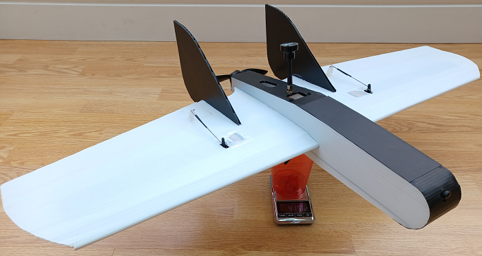
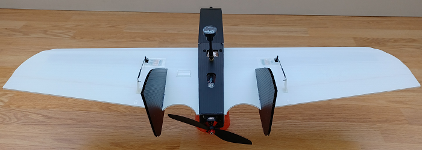
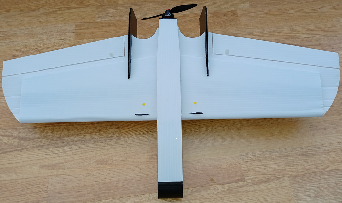

# Vector
The vector is an FPV RC polypropylene plane I have designed and built from sheets 
of 3 & 4mm fluted polypropylene board (Correx).It’s based on the [Flite Test FT Goblin.](https://www.youtube.com/watch?v=2-Z3un-X16U) 

The fuselage is my own design and more streamlined than the original, the wing is made
from one piece and modified from the original.
It’s put together using CA glue apart from fuselage to wing, nose cover, VTX and engine mount
Where I have used hot glue. 

The advantages of fluted plastic are increased strength and durability compared to foam board, 
With only a slight increase in weight.The disadvantages, more difficult to cut than foam board and more planning.

# Performance

It's [fast](https://www.youtube.com/watch?v=4V25RjghhR8&t=13s) and agile, shallow glide angle with no tip stall. Max flight time 25mins on a 4s lipo.

# Specifications

Airframe weight is 260gms (approx), with electronics and 4s 1500mAh is 590gms.
12° throws with servo rate set to 80% and 40% expo.
The FC is running INAV 2.6.1
Flying Wing calculator V2
CG calc @20% all-round flyer = 36.96mm back lead edge
Wing area = 138550
MAC Distance = 166mm
MAC length = 182.27mm.
22 Amps full throttle  3s lipo and 35 Amps on 4s.

# Hardware

Omnibus F4   (modified)
Racerstar MG90S 9g Micro Metal Gear Analog Servo’s
Matek micro BEC     DC 7V ~ 21V Input (5s max) DC 5V or 12V Output 1.5 Amp 1g
Rubycon low esr capacitor
Flycolor X-Cross BL-32 ESC 50A 3-6S ESC
BrotherHobby Returner R5 2306 2450KV 4-5S
KingKong 6040 Prop
Caddx Ant Nano 1200 TVL 16:9 Lens 1.8mm 165° FOV
Matek 5.8G 40CH 25/200/500mW VTX-HV
FrSky R9MM 868MHz 
Menace RC Stubby Raptor RHCP 1.09db 62mm Short Antenna 
8M Ublox M8N GPS Module

# Build

I started with the Flite Test Goblin plans for the wing, I printed these out and used “Spray & Stick” temporary glue to mount the to a piece of 3mm Correx sheet. I cut this out as a one-piece wing.
I modified the spars and assembled the wing with CA glue, similar to the Flite Test build video.
I then designed and built a fuselage out of 3mm Correx. I did some test flights and after many crashes! I worked out the C G for my plane. I then used “Design Spark Mechanical” free CAD software and plotted the build. I then used DSM to improve and refine my build, rebuilding the fuselage. I posted YouTube videos of the build process here.

# Motivation

I have been building and flying FPV quadcopters for a few years now and like many I progressed into RC planes, starting with Flite Test foam board builds.
I wanted to build an FPV wing style plane similar to a [Mini Drak](https://www.youtube.com/watch?v=hlEd-lXy8Zg
) and have the crash resilience of a quadcopter! I chose the FT Goblin and fluted polypropylene board as the mixture fitted my requirements. I wasn’t overly concerned about the weight, more the survivability of the plane.
As it turned out, the weight comes in very close to my quads and not that much heavier than the FT Goblin, with the advantage of being a lot stronger and surviving many a poor landing!
It’s also a relatively inexpensive plane to build, Fluted boards are very cheap and like foamboard 
builds, if you break a part, you can just print the plans and build another.
I have also learned a lot of new skills in the process, how to use CAD software being one of them.

